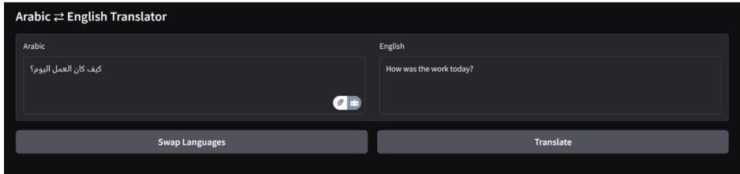
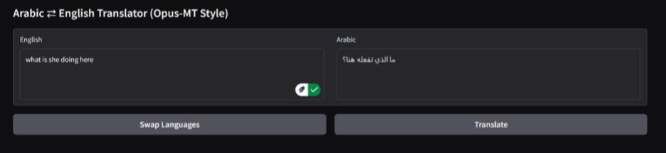

<div align="center">

# Arabic ↔ English Machine Translation

**Transformer-based bidirectional translation using BLOOMZ and Helsinki-NLP Opus-MT**

`NLP` · `Machine Translation` · `Transformers` · `BLOOMZ` · `Opus-MT` · `Hugging Face` · `Gradio`

</div>

## Overview

This academic NLP project implements a **bidirectional Arabic ↔ English machine translation pipeline** using two pretrained transformer approaches:

- **BLOOMZ-560M** for zero-shot, prompt-based translation.
- **Helsinki-NLP Opus-MT** for direct Arabic→English and English→Arabic neural machine translation.

The workflow also covers **OPUS100 dataset preprocessing**, SentencePiece/BPE tokenization, interactive **Gradio** translation interfaces, and translation-quality evaluation with **BLEU, ChrF, BERTScore, and COMET**.

> **Evaluation note:** The quantitative scores reported below are the project's **BLOOMZ evaluation results**. Opus-MT was implemented and demonstrated, but the academic report explicitly states that it was not included in the reported metric results.

## Demo

<table>
<tr>
<td align="center"><b>BLOOMZ — Arabic → English</b></td>
<td align="center"><b>Opus-MT — English → Arabic</b></td>
</tr>
<tr>
<td></td>
<td></td>
</tr>
</table>

Additional interface examples are available in [`assets/`](assets/).

## Project Pipeline

```text
OPUS100 Arabic–English dataset
            │
            ▼
   Cleaning & filtering
   - remove empty/duplicate pairs
   - normalize text
   - keep sentences with 3–50 words
            │
            ▼
 SentencePiece BPE tokenization
            │
       ┌────┴────┐
       ▼         ▼
   BLOOMZ      Opus-MT
 zero-shot    MarianMT
 prompting    translation
       │         │
       └────┬────┘
            ▼
      Gradio interface
            │
            ▼
 Evaluation: BLEU · ChrF · BERTScore · COMET
```

## Models

| Model | Role in the project | Approach |
|---|---|---|
| `bigscience/bloomz-560m` | Arabic ↔ English translation | Decoder-only multilingual LLM used with zero-shot prompts |
| `Helsinki-NLP/opus-mt-ar-en` | Arabic → English | MarianMT encoder-decoder model |
| `Helsinki-NLP/opus-mt-en-ar` | English → Arabic | MarianMT encoder-decoder model |
| LLaMA 2 + QLoRA | Explored but not included in final results | Planned 4-bit QLoRA fine-tuning; stopped because of Colab/GPU limitations |

## Dataset & Preprocessing

The project uses the **Arabic–English split of OPUS100**. The notebook performs preprocessing for both translation directions:

1. Loads the OPUS100 parallel corpus.
2. Extracts source and target sentences for **EN→AR** and **AR→EN**.
3. Removes empty and duplicate sentence pairs.
4. Filters sentences to **3–50 words**.
5. Normalizes text and removes punctuation.
6. Trains separate **SentencePiece BPE** tokenizers with an 8,000-token vocabulary.
7. Saves both plain cleaned and BPE-tokenized CSV files for later use.

Generated datasets and tokenizer artifacts are excluded from Git through `.gitignore` because they can be reproduced from the notebook.

## Evaluation

The notebook evaluates **100 cleaned sentence pairs per translation direction** for BLOOMZ. The final project results are:

| Metric | Arabic → English | English → Arabic |
|---|---:|---:|
| BLEU | **0.0790** | **0.0367** |
| ChrF | **28.2617** | **18.1714** |
| BERTScore (F1) | **0.8385** | **0.4848** |
| COMET | **0.6771** | **0.5956** |

The project used multiple metrics because they capture different aspects of translation quality: BLEU focuses on n-gram overlap, ChrF on character-level similarity, while BERTScore and COMET provide more semantic evaluation. The exact values are also available in [`results/bloomz_metrics.csv`](results/bloomz_metrics.csv).

## Repository Structure

```text
Arabic-English-Machine-Translation/
├── README.md
├── requirements.txt
├── .gitignore
├── results/
│   └── bloomz_metrics.csv
├── notebooks/
│   └── machine_translation.ipynb
└── assets/
    ├── bloomz/
    │   ├── bloomz_ar_to_en.jpg
    │   └── bloomz_en_to_ar.jpg
    └── opusmt/
        ├── opusmt_ar_to_en.jpg
        └── opusmt_en_to_ar.jpg
```

## Running the Notebook

This project was developed in a notebook/Google Colab-style environment. A GPU is recommended for faster inference and COMET evaluation.

```bash
pip install -r requirements.txt
```

Then open:

```text
notebooks/machine_translation.ipynb
```

The notebook downloads the public OPUS100 dataset and pretrained Hugging Face models when required. Dataset preprocessing creates local CSV and SentencePiece files; these generated artifacts are intentionally not stored in the repository.

## Interactive Translation

Both BLOOMZ and Opus-MT are connected to **Gradio** interfaces that support:

- Arabic → English translation
- English → Arabic translation
- Language-direction swapping
- Direct text input and generated translation output

## Limitations & Future Work

The academic report identifies several directions for improvement:

- Fine-tune translation models to improve fluency and accuracy.
- Compare BLOOMZ and Opus-MT quantitatively using the same evaluation pipeline.
- Improve decoding strategies.
- Extend support to **dialectal Arabic** and domain-specific translation.
- Revisit parameter-efficient fine-tuning of larger models when sufficient compute is available.

The project also explored **LLaMA 2 with QLoRA**, but full fine-tuning was not completed because the available Colab environment did not provide sufficient GPU memory / compatible bitsandbytes support. It was therefore excluded from the final experimental results.

## Academic Context

**Course:** CAI350 — Natural Language Processing  
**Supervisor:** Dr. Eman Aljabarti  
**Project type:** Academic team project

**Team:**
- Layan Alshaheen
- Leen Khashugji
- **Reema Alkathiry**
- Shaden Mohammed Alsaif
- Shouq Aldossari

The source report lists the project as a group submission but does not assign individual implementation modules to specific team members, so this repository does not claim individual ownership of particular model components.

---

<div align="center">
Built as an academic exploration of multilingual NLP and neural machine translation.
</div>
